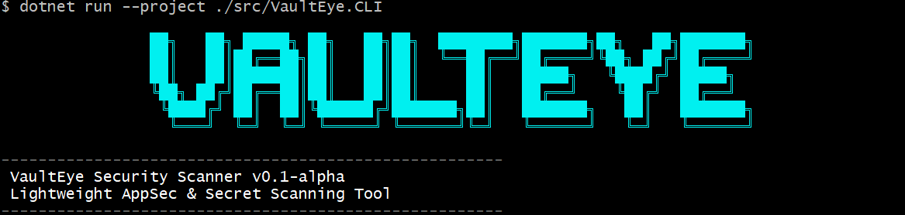
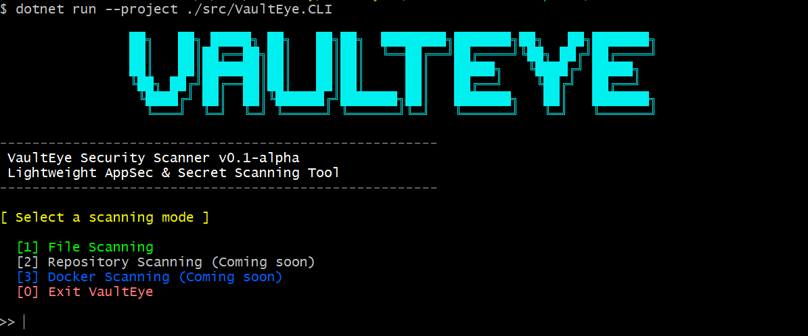
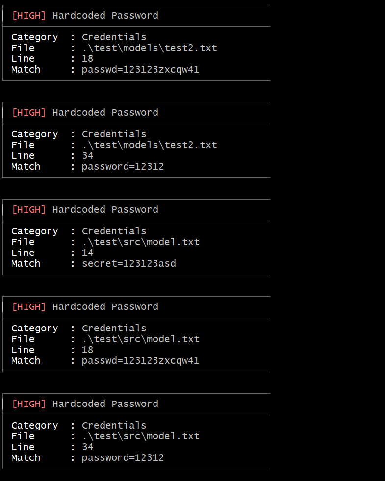
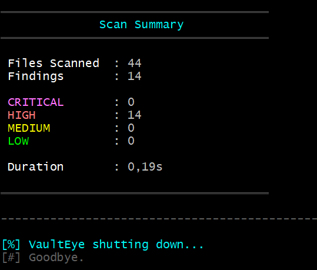

# VaultEye

<p align="center">
  
</p>

<p align="center">
  <b>Lightweight AppSec & Secret Scanning Tool</b>
</p>

<p align="center">
  Recursive security scanner for detecting secrets, tokens, credentials and sensitive data in source code and repositories.
</p>

---

# Overview

VaultEye is an AppSec-focused security scanner built with C# and .NET.

The project was created to study and implement real-world concepts related to:

- Application Security (AppSec)
- Secure SDLC
- Secret Scanning
- Static Analysis
- DevSecOps tooling
- Detection Engineering

VaultEye recursively scans files and repositories searching for sensitive information such as:

- JWT Tokens
- AWS Keys
- GitHub Tokens
- API Keys
- Bearer Tokens
- Connection Strings
- Private Keys
- Passwords
- Secrets

---

# Features

## Current Features

- Recursive directory scanning
- Multi-language file support
- Regex-based detection engine
- Severity classification
- Category classification
- JSON report export
- CLI arguments
- Interactive CLI mode
- Findings summary
- Ignore directories support
- Extension filtering
- Modular architecture

---

# Supported Detection Rules

| Rule | Severity |
|------|------|
| JWT Tokens | HIGH |
| AWS Access Keys | HIGH |
| GitHub Tokens | HIGH |
| Generic API Keys | HIGH |
| Bearer Tokens | HIGH |
| Connection Strings | MEDIUM |
| Private Keys | CRITICAL |
| Password Patterns | HIGH |

---

# Project Architecture

```txt
CLI
 ├── Program.cs

Core
 ├── ScanOrchestrator.cs

Scanner
 ├── FileScannerService.cs

Rules
 ├── Engines
 │    └── RegexRuleEngine.cs
 │
 ├── Rules
 │    ├── JwtRule.cs
 │    ├── AwsKeyRule.cs
 │    ├── GithubTokenRule.cs
 │    └── ...
 │
 └── RuleFactory.cs

Reporting
 ├── Formatters
 │    ├── ConsoleFindingFormatter.cs
 │    └── ConsoleSummaryFormatter.cs
 │
 └── Exporters
      └── JsonReportExporter.cs

Models
 ├── Finding.cs
 ├── Rule.cs
 ├── ScanResult.cs
 └── ScannedFile.cs
```

---

# Installation

## Clone Repository

```bash
git clone https://github.com/Guilherme774/VaultEye.git
```

---

## Enter Project

```bash
cd VaultEye
```

---

## Build Project

```bash
dotnet build
```

---

## Run Project

```bash
dotnet run --project src/VaultEye.CLI
```

---

# Usage

# Interactive Mode

```bash
dotnet run --project src/VaultEye.CLI
```

Opens the interactive menu:

```txt
[1] File Scanning
[2] Repository Scanning
[3] Docker Scanning
[0] Exit
```

---

# CLI Mode

## Scan a directory

```bash
dotnet run --project src/VaultEye.CLI -- scan ./project
```

---

## Export JSON report

```bash
dotnet run --project src/VaultEye.CLI -- scan ./project --json
```

---

# Example Output

```txt
┌─────────────────────────────────────
│ [HIGH] JWT Token
├─────────────────────────────────────
│ File     : appsettings.json
│ Line     : 18
│ Category : Authentication
│ Match    : eyJhbGcOiJIUzI1Ni...
└─────────────────────────────────────

══════════════════════════════════════
              Scan Summary
══════════════════════════════════════

 Files Scanned  : 43
 Findings       : 16

 CRITICAL       : 0
 HIGH           : 16
 MEDIUM         : 0
 LOW            : 0

 Duration       : 0.03s

══════════════════════════════════════
```

---

# JSON Export Example

```json
{
  "filesScanned": 43,
  "findingsCount": 16,
  "durationSeconds": 0.03,
  "findings": [
    {
      "ruleName": "JWT Token",
      "severity": "HIGH",
      "category": "Authentication",
      "filePath": "appsettings.json",
      "lineNumber": 18,
      "matchedContent": "eyJhbGcOi..."
    }
  ]
}
```

---

# Roadmap

## Current

- [x] Recursive scanning
- [x] Regex detection engine
- [x] Severity classification
- [x] Category classification
- [x] CLI support
- [x] JSON export
- [x] Interactive mode
- [x] Extension filtering

---

## Next Features

- [ ] SARIF export
- [ ] Entropy analysis
- [ ] Docker scanning
- [ ] Git history scanning
- [ ] Parallel scanning
- [ ] CI/CD integration
- [ ] GitHub Action
- [ ] Custom rule loading
- [ ] Ignore file support (.vaultignore)
- [ ] Performance optimization
- [ ] Binary detection
- [ ] Minified file detection

---

# Screenshots

# 1. CLI Startup Banner

## Image Location



---

# 2. Findings Detection

## Image Location



---

# 3. Final Summary

## Image Location



---

# Technologies

- C#
- .NET 8
- Regex Engine
- System.Text.Json

---

# Purpose

This project was created for educational and research purposes focused on:

- AppSec
- DevSecOps
- Detection Engineering
- Secure Development
- Secret Scanning

---

# License

MIT License

---

# Author

Guilherme Silva

GitHub:
https://github.com/Guilherme774